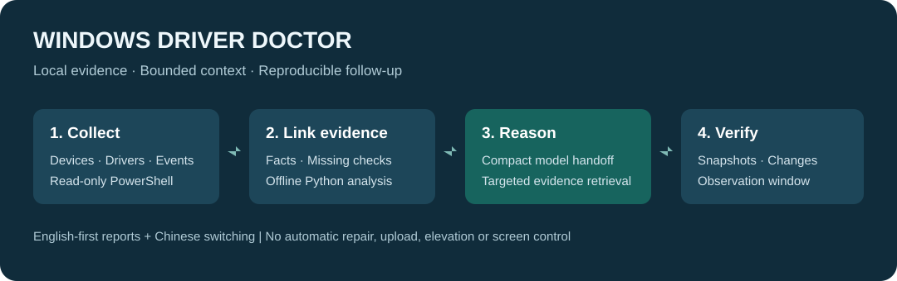

# Windows Driver Doctor

**基于证据的 Windows 驱动、设备、开机与蓝屏排障 skill。**

以英文为默认语言，配套中文说明和可切换的中英文 HTML 报告。[English](README.md)

[](https://github.com/LU-KELVIN938/windows-driver-doctor/actions/workflows/ci.yml)
[](LICENSE)



它把设备状态、驱动版本、系统事件、开机时间线、转储文件信息和前后快照对比串起来。报告区分事实、可能原因和缺失证据，不会把一个 `.sys` 出现在堆栈中直接当成根本原因。

## 安装

将仓库内容（不含 `.git`）放入对应目录：

| 工具 | 目录 |
| --- | --- |
| Codex | `~/.codex/skills/windows-driver-doctor/` |
| Claude Code | `~/.claude/skills/windows-driver-doctor/` |
| Cursor | `.cursor/skills/windows-driver-doctor/` |
| 其他兼容工具 | `.agents/skills/windows-driver-doctor/` |

例如：“使用 windows-driver-doctor，检查我的电脑为什么睡眠唤醒后断网，用中文给出报告。”

## 直接运行

需要 Windows 10/11、Windows PowerShell 5.1 或 PowerShell 7，以及 Python 3.10+。不需要第三方 Python 包。首次检查用普通权限即可。

```powershell
python scripts/doctor.py collect --out work\audit --lang zh
python scripts/doctor.py analyze --input work\audit\snapshot.json --out work\report --lang zh
python scripts/doctor.py analyze --input work\audit\snapshot.json --debugger-log work\analyze.txt --out work\crash --lang zh
python scripts/doctor.py compare --before work\before\snapshot.json --after work\after\snapshot.json --out work\comparison --lang zh
```

输出 `snapshot.json`、`findings.json`、`report.md` 和可离线查看的 `report.html`。HTML 报告支持 English / 简体中文切换。工具只生成文件，不自动打开浏览器。已存在的输出文件默认不会覆盖，确需覆盖时添加 `--overwrite`。

不想读取本机，可用模拟数据体验报告：

```powershell
python scripts/doctor.py analyze --input examples\demo-snapshot.json --out work\demo --lang zh
```

模拟报告带有明确标记，不代表你的电脑检查结果。

## 功能与边界

- 检查当前连接设备的故障代码，区分已断开的设备。
- 收集驱动厂商、版本、日期、INF 和设备关联；不因为驱动日期较老就建议更新。
- 收集显卡、网卡、USB、音频、磁盘、固件和电池信息。
- 整理开机事件、启动项、自动服务及近期蓝屏、显示、WHEA、服务超时等记录。
- 收集转储文件元数据；需要深入分析时可导入已保存的 WinDbg 文本。
- 比较修复前后的设备状态、驱动版本、新增事件和有效开机记录。
- 对无法读取的检查明确标注“未验证”，不会解释成“正常”。

操作屏幕、截屏、启动可见程序需要先取得本次范围的明确同意。安装软件、更新或卸载驱动、改注册表、清理、重启、改安全设置和创建定时任务，也不属于只读诊断的默认权限。

报告做尽力脱敏，包括常见用户名路径、私网 IPv4 地址、序列号字段和设备标识。它不是完全匿名化；分享前应检查，真实诊断数据和转储文件不要提交到 GitHub。

## 参考与验证

[功能对应表](references/coverage.md)说明了参考哪些项目以及增加了哪些能力。[来源说明](ATTRIBUTION.md)列出完整链接。代码独立编写，未复制没有明确许可的实现，也未打包未经核实的“问题驱动黑名单”。

自动测试覆盖离线分析和关键判断边界；Windows CI 还会检查脚本语法并运行有边界的只读采集。测试不等同于验证所有设备上的诊断准确率，间歇性问题仍需修复后观察。

## 与直接使用 Codex 对话相比，增加了什么？

Codex 本身就能生成诊断命令。这套 skill 增加的是可复用的工程能力：一致的采集程序、明确的数据格式、设备与驱动关联、可复核的时间线、前后比较和有长度上限的模型输入。它让排障更容易重复与复查，不代表底层模型变聪明了。

| 需求 | 本项目提供的能力 |
| --- | --- |
| 修复后再做相同检查 | 使用同一个采集脚本与版本化 JSON 格式 |
| 知道故障设备对应哪个驱动 | 设备 → 签名驱动 → 设备配置事件关联 |
| 减少大量驱动和日志占用上下文 | 短摘要、症状筛选与有边界的证据读取 |
| 区分异常关机、应用崩溃和蓝屏 | 根据提供程序与事件内容分类，保留不确定性 |
| 事后复查结果来自哪里 | 记录代码、设置、输入与输出文件哈希 |
| 向普通用户解释结果 | 中英文 HTML 与 Markdown 报告 |
| 避免常见的武断判断 | 用行为测试约束误判边界 |

这些能力可以直接检查。是否比普通 Codex 诊断更准、一次完整排障是否更省 token，需要使用相同真实案例进行对比，不能由功能表推断。详见[验证说明](docs/VALIDATION.md)。

## 排障流程

1. 确认症状、发生时间、负载以及最近的 Windows、驱动或硬件变化。
2. 用普通权限进行只读采集，明确记录无法读取的检查。
3. 将当前设备的故障代码与驱动包和配置事件关联；必要时围绕事故时间整理日志。
4. 模型先读取短摘要，再按需获取相关证据，区分事实与可能原因。
5. 提出一个针对性步骤，例如核实 OEM 驱动包、分析匹配的转储或补充证据。
6. 经明确同意修改后，再采集并比较；间歇性故障需要约定观察期。

例如，检查一次唤醒后断网：

```powershell
python scripts/doctor.py collect --out work\wifi-incident --focus drivers --lang zh `
  --incident-time "2026-10-04T09:00:00+08:00" --days 7 --max-events 100
```

时间线查找事故前后 30 分钟的事件，以及此前七天的设备配置记录。时间上接近只是线索，不代表因果关系。驱动文件日期不会被解释成安装日期。

## 怎样减少 Codex 上下文占用？

完整设备清单与事件保存在本地，模型默认不读取全部数据。

```powershell
python scripts/doctor.py brief --input work\audit\findings.json --focus crash --max-chars 1800 --lang zh
python scripts/doctor.py evidence --input work\audit\snapshot.json --section drivers `
  --device-key aabbccdd00112233 --limit 5 --max-chars 2500
```

- 默认摘要上限为紧凑 JSON **2,400 个字符**，可调整，最小 800。
- `--focus drivers/crash/boot/all` 只选择与症状有关的摘要条目。
- 摘要保留设备故障代码或事件字段、置信类型和证据数量。
- 未验证状态、模拟数据标记及 `truncated` 标记保留。
- 深入排查时只读取相关设备或日志行，不把整个 HTML 或两份全量快照交给模型。
- 比较修复前后只看变化，并复用已有有效快照。

字符上限指 `brief` 输出的紧凑 JSON；保存文件中的缩进会增加文本长度。它控制输入数据量，不控制模型思考 token、输出 token 或整个会话费用。

### 可复现的上下文体积实验

```powershell
python scripts/benchmark-context.py
python scripts/benchmark-context.py --lang zh
```

实验使用模拟事故数据，并增加 400 个正常设备及驱动、600 条应用事件，将全量快照与一次面向蓝屏的短摘要对比。结果见[英文 JSON](docs/context-benchmark.en.json)和[中文 JSON](docs/context-benchmark.zh.json)。

| 模拟数据 | 字符数 | 此实验中的体积减少 |
| --- | ---: | ---: |
| 全量紧凑快照 | 227,325 | — |
| 英文蓝屏短摘要 | 1,034 | 99.55% |
| 中文蓝屏短摘要 | 710 | 99.69% |

**这是模拟数据的字符体积实验，不是实际 token 账单、完整会话成本、诊断准确率或普通 Codex 的实测对比。** 后续证据读取、分词器、语言、提示缓存和参考文档读取都会影响真实 token 用量。

## 每个输出文件的作用

| 文件 | 用途 |
| --- | --- |
| `summary.json` | 给模型的短摘要，建议先读 |
| `snapshot.json` | 完整脱敏证据与采集状态 |
| `findings.json` | 结构化检查条目、证据、判断类型和双语文本 |
| `report.html` | 离线中英文界面，可筛选、搜索和打印 |
| `report.md` | 所选语言的简明说明 |
| `manifest.json` | 工具版本、代码、设置、输入输出哈希与体积记录 |
| `comparison.json` | 前后对比命令的变化记录 |
| `debugger.txt` | 明确运行无界面 CDB 时保存的分析文本 |

[模拟报告界面](docs/demo-report.html)可保存到本地后自行打开。GitHub 普通文件查看页面展示 HTML 源码，不会运行页面。演示在两种语言下都标明为模拟数据。

## 各类问题检查哪些证据？

| 方向 | 主要证据 |
| --- | --- |
| 设备与驱动 | 连接状态、PnP 故障代码、驱动版本、INF、设备配置记录 |
| 显卡 | 显卡型号与版本、显示恢复事件、WHEA、负载和转储线索 |
| USB、音频、网卡 | 设备类别、端点或链路状态、睡眠唤醒时间线、驱动关联 |
| 蓝屏或异常重启 | 对应提供程序的蓝屏记录、转储元数据、WinDbg 文本和其他硬件信号 |
| 开机慢 | Event 100、慢组件、自动服务、启动项和登录任务 |
| 修复验证 | 后续快照、驱动或设备变化、新增事件、不同开机记录和观察期 |

### 可选的转储分析

```powershell
python scripts/doctor.py dump --dump "D:\evidence\crash.dmp" `
  --debugger "C:\Program Files (x86)\Windows Kits\10\Debuggers\x64\cdb.exe" --out work\dump --lang zh
```

这个命令明确使用现有微软 CDB，读取指定的本地转储，写入符号缓存，并向微软符号服务器请求符号。它不会安装调试器、复制或上传转储、打开可见窗口或附加到运行中的进程。只导入已保存的调试文本时不需要执行这些操作。

已有、经用户授权的 WinDbg HTTP 桥接使用方法见[蓝屏指南](references/crashes.md)，本项目不包含其 DLL。

### 可选的厂商问题公告

`collect` 或 `analyze` 可添加 `--advisories advisories.json`。本地数据按 `.sys` 文件名、厂商和数字版本区间匹配，匹配结果仍需核实官方公告和具体硬件。格式见[数据契约](references/schema.md)。不自动下载公告，也不执行其中的指令。

## 命令速查

| 命令 | 作用 |
| --- | --- |
| `collect` | 本机 Windows 只读采集并生成报告，不自动提权或修复 |
| `analyze` | 从已有快照离线分析，可导入调试文本或问题公告 |
| `compare` | 比较同一电脑的两份按时间排列的快照 |
| `dump` | 明确运行现有 CDB 并进行微软符号查询 |
| `brief` | 输出有长度上限的紧凑 JSON 摘要 |
| `evidence` | 读取指定清单或设备的有限数据行 |

运行 `python scripts/doctor.py COMMAND --help` 查看参数。采集窗口支持 1～90 天，每次查询日志最多 1～2,000 条；日志缺失和权限限制会明确记录。症状筛选影响模型摘要，不缩减采集覆盖面。

## 常见问题

**会自动修驱动吗？** 不会。它提供证据和建议，经用户授权后才能执行具体修改，并记录回滚与验证步骤。

**事件 41 说明电源坏了吗？** 不能这样判断。它说明发生了非正常重启；还需要蓝屏代码、转储和其他证据。

**为什么不更新所有日期旧的驱动？** Windows 内置驱动日期可能是刻意设置的，应该比较确切版本、硬件和 OEM 支持情况。

**必须管理员运行吗？** 默认不需要。读取受保护证据失败时标注未验证，只对影响结论的特定检查申请权限。

**没有 Windows 电脑能用吗？** 可以离线分析已有快照和调试文本；本机采集与执行 CDB 需要 Windows。

**报告能发到 GitHub 吗？** 先检查脱敏结果。它不保证完全匿名，真实转储、身份信息和电脑诊断快照不要提交到本仓库。

**保证更准确、更省 token 吗？** 不作全面保证。工程能力和上下文边界可以验证，但真实准确率及整个任务的费用需要相同案例实测。

## 项目状态与贡献

0.1.0 是初始版本，提供模拟行为测试与 Windows CI 检查；真实设备兼容性和根因判断准确率仍需要案例反馈。欢迎提供不含隐私的最小复现、事件解析改进、双语文本或可核实的厂商公告。见[贡献指南](CONTRIBUTING.md)、[隐私说明](SECURITY.md)和[验证细节](docs/VALIDATION.md)。

如果它对你有帮助，欢迎 star；带有脱敏复现材料的 issue 和聚焦的 PR 更能帮助项目提高可靠性。
